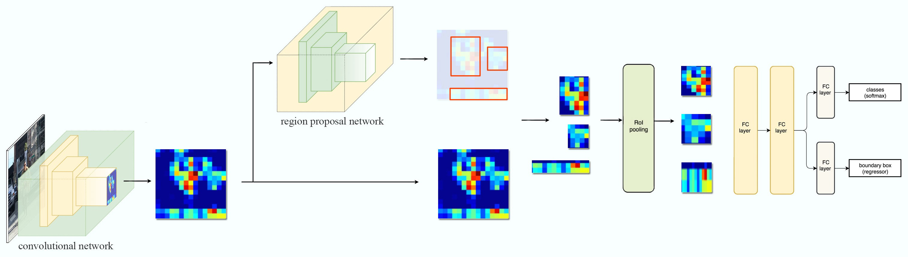

# MaskRCNN
### Instance image segmentation with Mask R-CNN

At First We want to know those of network are contain in MaskRCNN and it previous algorithm.If we understand MaskRCNN then we need understand Faster RCNN Befor MaskRCNN.

let see the Faster RCNN model Architecture,



#### Region proposal network (RPN)

The RPN should take two inputs, image features (i.e. features extracted by ResNet) and ground truth bounding boxes and produce object proposals and corresponding “objectness” scores. RPN


I’m visualizing something like basic:

```py
x = keras.layers.Input((223, 223, 3))

a = keras_resnet.ResNet50(x)

b = keras.layers.Input((None, 4))

y = keras_rcnn.layers.RPN((14, 14))([a, b])
```

I try to show real network example,

```py
x = keras.layers.Input((223, 223, 3))
a = keras_resnet.ResNet50(x)
[rpn_cls, rpn_reg] = keras_rcnn.layers.RegionProposalNetwork()(a)
rpn_pred = keras.backend.concatenate([rpn_cls, rpn_reg])
proposals = keras_rcnn.layers.ObjectProposal()([rpn_cls, rpn_reg])
[rcnn_cls, rcnn_reg] = keras_rcnn.layers.ROI([7, 7])([x, proposals])
model = Model( inputs=x, outputs=[rpn_pred, rcnn_cls, rcnn_reg])
model.compile( loss=[rpn_pred_loss, rcnn_cls_loss, rcnn_reg_loss], optimizer="adam")
```
Another example,
```py

classes = 2

x = keras.layers.Input((224, 224, 3))

y = keras_resnet.ResNet50(x)

rpn_classification = keras.layers.Conv2D(9 * 1, (1, 1), activation="sigmoid")(y.layers[-2].output)

rpn_regression = keras.layers.Conv2D(9 * 4, (1, 1))(y.layers[-2].output)

rpn_prediction = keras.layers.concatenate([rpn_classification, rpn_regression])

proposals = keras_rcnn.layers.object_detection.ObjectProposal(300)([rpn_classification, rpn_regression])

y = keras_rcnn.layers.ROI((7, 7) 32)([x, proposals])
y = kera.layers.AveragePooling2D((7, 7))(y)
y = keras.layers.Dense(4096)(y)

score = keras.layers.Dense(classes, activation="softmax")(y)

boxes = keras.layers.Dense(4 * (classes - 1))(y)

model = keras.models.Model(x, [rpn_prediction, score, boxes])

model.compile(optimizer="adam", loss="mse")


```
